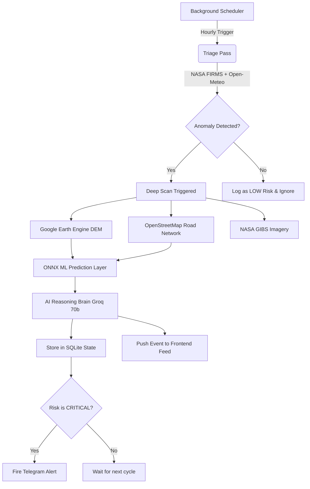

<div align="center">
  
# DisasterMind

**Autonomous National Disaster Response Intelligence Agent**

[](https://fastapi.tiangolo.com/)
[](https://reactjs.org/)
[](https://leafletjs.com/)
[](https://groq.com/)
[](https://www.python.org/)
[](https://opensource.org/licenses/MIT)

*When massive floods ravage steep terrains or sudden wildfires ignite, every second counts. DisasterMind was built to prevent catastrophic intelligence failures. By fusing real-time satellite telemetry, machine learning predictive models, and LLM tactical reasoning, DisasterMind autonomously synthesizes critical situation reports before human responders even reach the ground.*

</div>

---

## Table of Contents
1. [The Problem & Our Solution](#-the-problem--our-solution)
2. [Core Capabilities](#-core-capabilities)
3. [System Architecture](#-system-architecture)
4. [Machine Learning Pipeline](#-machine-learning-pipeline)
5. [Project Structure](#-project-structure)
6. [Live Telemetry Layers](#-live-telemetry-layers)
7. [Getting Started](#-getting-started)
8. [API Reference](#-api-reference)
9. [Contributing](#-contributing)

---

## The Problem & Our Solution

**The Problem:** Traditional disaster response is highly reactive. Government agencies and first responders rely on fragmented data sources, delayed human analysis, and manual reporting. By the time a comprehensive Situation Report (SitRep) is compiled, the ground reality has often worsened.

**The Solution:** DisasterMind is a continuous, autonomous intelligence orchestrator. It divides the entirety of India into ~7,200 geographical grid cells and continuously monitors them. The moment satellite sensors detect an anomaly (e.g., thermal hotspots, heavy precipitation, flood proxy data), the system performs a localized "Deep Scan," runs the data through a machine learning ensemble to verify the threat, and uses a large language model (LLM) to generate a tactical response plan.

---

## Core Capabilities

- **Autonomous National Monitor:** Runs continuously in the background using `APScheduler`. It scrapes NASA FIRMS, Open-Meteo, and Google Earth Engine data across the entire grid on an hourly cadence.
- **Hybrid ML/AI Architecture:** Streams raw sensor data through a predictive ML ensemble (`Random Forest` & `XGBoost`) to establish mathematical consensus. It then feeds those predictions into Groq's `llama-3.3-70b-versatile` LLM for tactical reasoning.
- **Telegram Alerting Engine:** Automatically dispatches high-priority, government-style text alerts directly to registered response teams the moment a CRITICAL threshold is crossed.
- **Glassmorphic Cartography UI:** A stunning, fully responsive React frontend featuring a live threat roster, an autonomous agent log feed, and an interactive CartoDB dark-mode map overlay with 6 live WMS satellite layers.
- **NDMA-Ready PDF Engine:** Generates rigorous, meticulously formatted A4 Situation Reports using `ReportLab`, complete with tactical directives, resource allocation tables, and geographic coordinates.

---

## Production-Grade Security & Resilience

DisasterMind is hardened for open-web deployments:
- **API Key Authentication:** Heavy ML inference and LLM endpoints are protected by an `X-API-Key` dependency, preventing quota exhaustion and unauthorized scans.
- **Asynchronous Event Queue:** External alerts (Telegram) are decoupled via an in-memory `asyncio.Queue` with automatic exponential backoff retries. Network timeouts will never block the core ML pipeline.
- **Automated Database Vacuuming:** A scheduled background job strictly caps the SQLite log and history tables (max 2,000 records) and executes `VACUUM` to prevent disk overflow on constrained cloud environments like Render.
- **Aggressive Edge Caching:** Static grid payloads (~1MB) are served with `Cache-Control` headers, ensuring near-instant frontend loads and massive bandwidth savings.
- **Zero-Trust Input Sanitization:** All LLM prompt inputs are sanitized against injection attacks, and Telegram markdown is strictly escaped to prevent HTTP 400 crashing.
- **Distributed Process Locking**: Uses Redis to prevent multiple background workers (like Gunicorn instances) from running overlapping national scans and doubling API costs.
- **Fail-Safe Deterministic Degradation**: If third-party APIs (Google Earth Engine, NASA) time out, or the LLM crashes, the system deterministically degrades into an algorithmic planner to guarantee a response plan is always generated.
- **Zero-Trust State Wiping**: The autonomous monitor securely executes a `DELETE` operation on stale database records at the start of every hour, mathematically ensuring the dashboard is immune to stale intelligence.

---

## Judging & Demo Mode

DisasterMind is a **scientifically accurate live monitoring system**. This means if you are reviewing the application on a sunny day across India, the map will correctly report **0 Active Threats** and all grid cells will display a **NONE** risk level.

To properly evaluate the dashboard UI, AI capabilities, and resource planners during the hackathon judging period without waiting for a real-world disaster:

1. Click the highly visible **"Load Demo Data"** button at the top of the dashboard.
2. The frontend will hit a dedicated `/api/demo/inject` backend endpoint.
3. This will instantly pause the live weather monitor, wipe the database clean, and inject **3 high-fidelity simulated disasters**:
   - **CRITICAL Cyclone Threat in Mumbai:** Simulates 210mm of rainfall and a 95% flood probability.
   - **HIGH Flood Threat in Assam:** Simulates 140mm of rainfall in Guwahati.
   - **MODERATE Landslide Threat in Uttarakhand:** Simulates 12 active fires and heavy rain in Dehradun.
4. The page will automatically refresh, and the dashboard will populate with fully generated AI response plans, resource allocations, and critical alerts for you to explore. 

*(Note: The background monitor will automatically clean up these simulated threats on its next hourly cycle).*

---

## System Architecture

DisasterMind employs a robust, event-driven pipeline separated into distinct triage and deep-scan phases to conserve API quotas and computational resources.



---

## Machine Learning Pipeline

Rather than relying entirely on LLMs for decision making (which can hallucinate), DisasterMind uses a deterministic ML ensemble exported to `ONNX` for sub-millisecond inference:
1. **Flood Risk Classifier (XGBoost):** Evaluates 3-day precipitation forecasts, current soil moisture, and local Digital Elevation Model (DEM) data to predict flood probability.
2. **Severity Classifier (Random Forest):** Fuses the flood probability with NASA VIIRS thermal anomaly counts to output a definitive severity label (`LOW`, `MODERATE`, `HIGH`, `CRITICAL`).
3. **LLM Synthesis (Groq Llama 3):** Only *after* the ML layer establishes a mathematical consensus does the LLM step in to translate the data into human-readable tactical plans.

---

## Project Structure

The repository is divided into a standalone Vite/React frontend and a modular FastAPI backend.

```text
disastermind/
├── frontend/                 # React + Vite application
│   ├── src/
│   │   ├── components/       # UI Components (IndiaMap, LiveReadings, AgentFeed)
│   │   ├── styles/           # Global CSS variables and Glassmorphism tokens
│   │   └── App.jsx           # Main Application Shell
│   └── package.json
└── backend/                  # Python FastAPI + Autonomous Worker
    ├── api/                  # FastAPI routes, middleware, and Database connection
    ├── core/                 # Autonomous Logic (Agent, Monitor, Report Generator)
    ├── services/             # External Integrations (Earth Engine, Telegram, State)
    ├── models/               # Grid definitions and ML ONNX Engine (`ml_layer/`)
    ├── scripts/              # Geospatial grid generation and test scripts
    ├── data/                 # SQLite databases (`disastermind_state.db`)
    ├── Dockerfile
    └── requirements.txt
```

---

## Live Telemetry Layers

The interactive React-Leaflet map allows operators to toggle between real-time WMS satellite overlays injected directly from NASA GIBS and Open-Meteo:
| Layer Name | Source | Purpose |
|------------|--------|---------|
| **Live Fires** | NASA FIRMS (VIIRS) | Tracking active wildfires and industrial thermal anomalies. |
| **Precipitation** | NASA IMERG | Real-time rain rate monitoring for flash flood prediction. |
| **Vegetation Health** | MODIS NDVI | Assessing drought severity and landslide vulnerability. |
| **Surface Temperature** | MODIS LST | Tracking deadly heatwaves across the subcontinent. |
| **Soil Moisture** | SMAP L4 | A primary proxy for identifying waterlogged, flood-prone regions. |

---

## Getting Started

### Prerequisites
- **Node.js** (v18 or higher)
- **Python** (v3.12 or higher)
- **Docker & Docker Compose** (Optional, for containerized deployment)

### 1. Environment Variables
Create a `.env` file in the `backend/` directory:
```ini
# Security
API_KEY=your_secure_api_key

# Core LLM Engine
GROQ_API_KEY=your_groq_api_key

# Alerting Infrastructure
TELEGRAM_BOT_TOKEN=your_bot_token
TELEGRAM_CHAT_ID=your_chat_id

# Google Earth Engine (Requires service account JSON)
EE_CREDENTIALS_JSON='{"type": "service_account", ...}'

# CORS Configuration (Production only)
ALLOWED_ORIGINS=https://your-frontend-url.vercel.app
```

### 2. Local Development Setup

**Start the Backend API & Autonomous Worker:**
```bash
cd backend
python -m venv venv
source venv/bin/activate  # On Windows: venv\Scripts\activate
pip install -r requirements.txt
uvicorn api.main:app --reload --host 0.0.0.0 --port 8000
```

**Start the Frontend Dashboard:**
```bash
cd frontend
npm install
npm run dev
```
Navigate to `http://localhost:3000` to view the intelligence console.

### 3. Docker Deployment
DisasterMind is production-ready. The included `docker-compose.yml` orchestrates the FastAPI backend, the React frontend build, and a Redis instance (used for distributed locking to prevent concurrent scheduled scans).

```bash
docker-compose up --build -d
```

### 4. Cloud Deployment (Render & Vercel)
The architecture is specifically optimized for Serverless/PaaS deployment:
- **Backend (Render):** Deploy the `backend/` directory as a Web Service. Ensure your Build Command is `pip install -r requirements.txt` and Start Command is `uvicorn api.main:app --host 0.0.0.0 --port $PORT`. Add the environment variables from `.env`.
- **Frontend (Vercel):** Connect your repository to Vercel and set the Root Directory to `frontend/`. Add `VITE_API_KEY=your_secure_api_key` to match the backend.

---

## API Reference

The backend exposes a fully documented REST API via Swagger UI. Once the backend is running, visit `http://localhost:8000/docs`.

### Key Endpoints:
- `GET /api/monitor/status` - Returns the health of the ML engine and background scheduler.
- `GET /api/monitor/grid` - Fetches the coordinates and baseline risk for all 7,200 grid cells.
- `GET /api/monitor/threats` - Returns the current Active Threat Roster (cells evaluated as MODERATE or higher).
- `GET /api/monitor/feed` - Retrieves the latest autonomous agent execution logs.
- `GET /api/cell/{cell_id}/plan` - Forces the LLM to generate a real-time response plan for a specific cell.
- `GET /api/cell/{cell_id}/report/pdf` - Generates and streams a downloadable A4 Situation Report.

---

## Contributing
We welcome contributions from data scientists, frontend engineers, and disaster response professionals! 
1. Fork the repository
2. Create a feature branch (`git checkout -b feature/AmazingFeature`)
3. Commit your changes (`git commit -m 'Add some AmazingFeature'`)
4. Push to the branch (`git push origin feature/AmazingFeature`)
5. Open a Pull Request

## License
This project is licensed under the MIT License - see the [LICENSE](LICENSE) file for details.

<div align="center">
  <br/>
  <i>Built to save lives through data-driven autonomy.</i>
</div>


